# go-task

## 远程日志

### 上报ELK

以sendmessage服务为例
```go
func NewSendLogic(ctx context.Context, svcCtx *svc.ServiceContext) *SendLogic {
	return &SendLogic{
		ctx:    ctx,
		svcCtx: svcCtx,
		//Logger: logx.WithContext(ctx),
		Logger: log.NewGoZeroELKLoggerWithContext(ctx, log.WithAppName("sendmessage"), log.WithFuncName("Send")),
	}
}
```

### 查询日志


## 远程配置
新增/修改 Apollo配置


## go-task模块介绍




## 分布式任务队列

https://github.com/hibiken/asynq

docker run --rm --name asynqmon -d -p 8098:8080 -e REDIS_ADDR=172.17.0.1:6379 hibiken/asynqmon

Web页面: http://127.0.0.1:8098/

## http反向代理
在director中通过北极星（服务发现）完成目标节点信息获取


## 服务发现与治理

心跳上报异常[TODO]

北极星

## 链路追踪 [TODO]

## 整合主流框架及组件 -- rk-boot

### 框架集成指标上报
rk-boot

### 手动上报重要指标
以manager/internal/metrics/metrics.go为例

### 在网关统一上报重要指标
以httproxy.go为例

## 服务监控

配置grafana

### 告警 [TODO]


## 滚动升级

高度分布式且不断变化的！