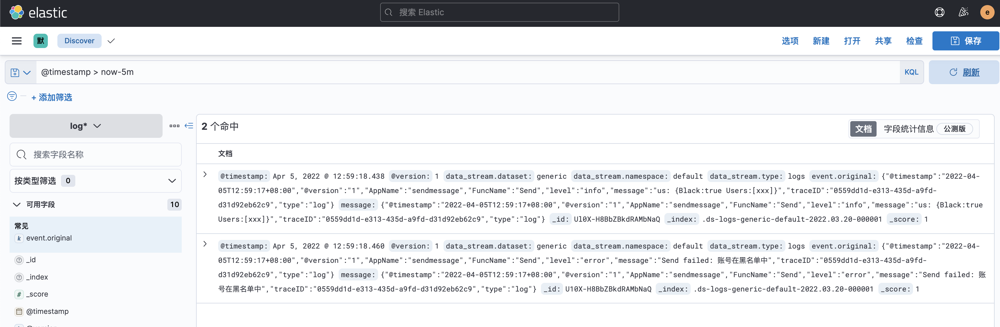
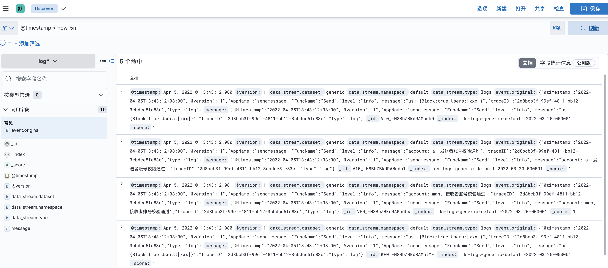
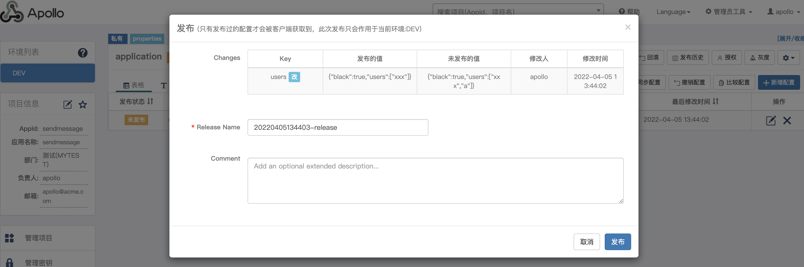
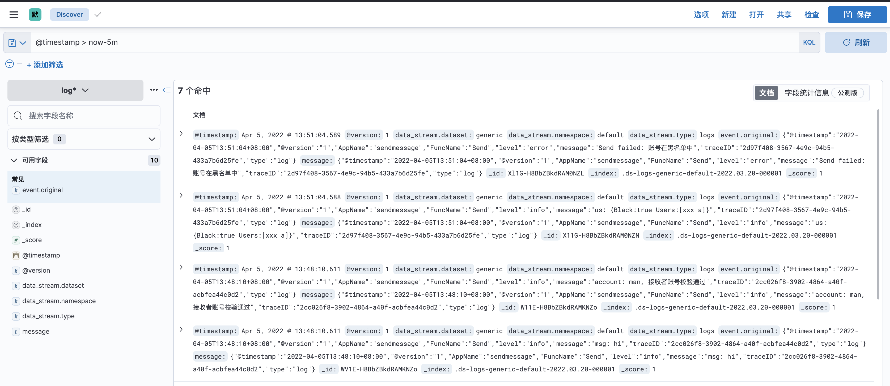
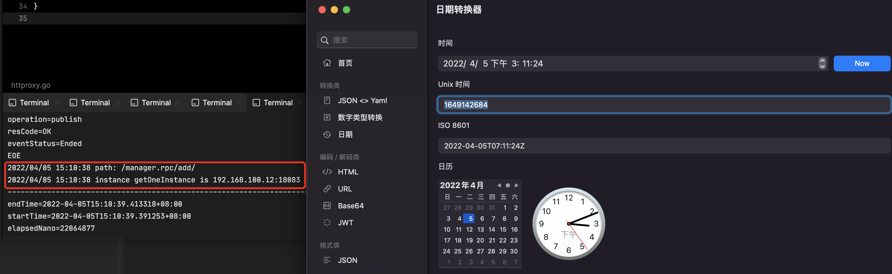
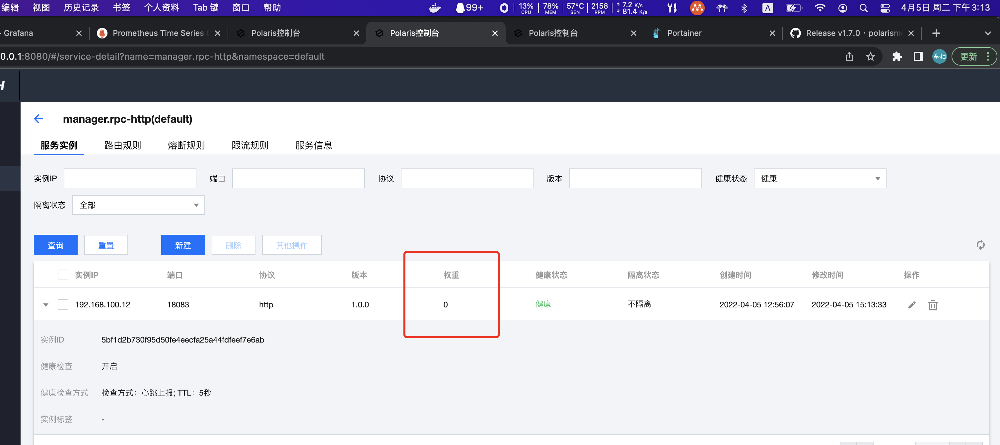
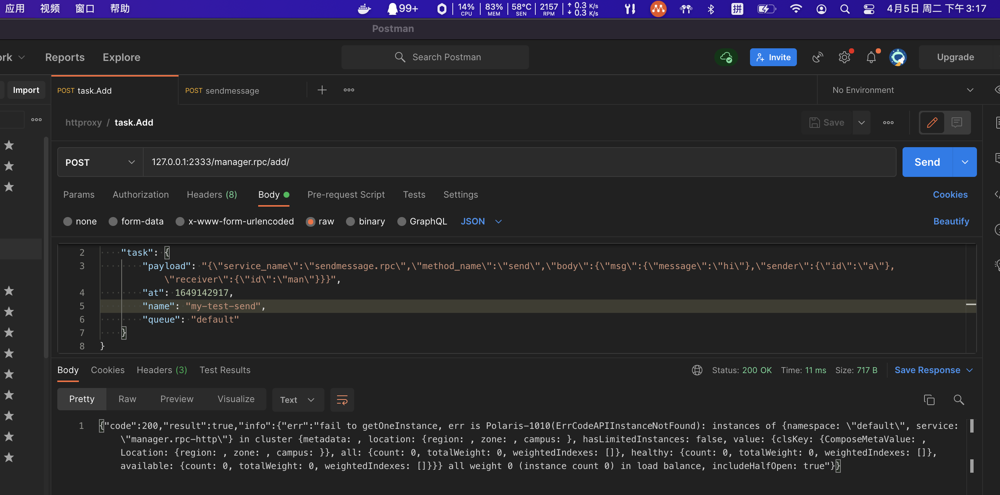

# go-task

## 远程日志

### 上报ELK

以sendmessage服务为例
```go
func NewSendLogic(ctx context.Context, svcCtx *svc.ServiceContext) *SendLogic {
	return &SendLogic{
		ctx:    ctx,
		svcCtx: svcCtx,
		//Logger: logx.WithContext(ctx),
		Logger: log.NewGoZeroELKLoggerWithContext(ctx, log.WithAppName("sendmessage"), log.WithFuncName("Send")),
	}
}
```

### 查询日志
http://127.0.0.1:5601/app/discover

通过KQL语句` @timestamp > now-5m`查询最近5分钟的日志




## 远程配置

新增/修改 Apollo配置

以添加发送名单为例


当前用户名单为黑名单，账号`a`不在名单内，因此发送信息成功



将用户`a`添加到名单中



此时`a`已经再黑名单中，发送失败



## go-task模块介绍


## 分布式任务队列

https://github.com/hibiken/asynq


docker run --rm --name asynqmon -d -p 8098:8080 -e REDIS_ADDR=172.17.0.1:6379 hibiken/asynqmon

Web页面: http://127.0.0.1:8098/


## http反向代理
在director中通过北极星（服务发现）完成目标节点信息获取

```go
getOneRequest := &api.GetOneInstanceRequest{}
getOneRequest.Namespace = namespace
getOneRequest.Service = serviceName
oneInstResp, err := gConsumer.GetOneInstance(getOneRequest)
if err != nil {
  errMsg = fmt.Sprintf("fail to getOneInstance, err is %v", err)
  return
}
instance := oneInstResp.GetInstance()
if instance == nil {
  errMsg = "no instance"
  return
}
```


## 服务发现与治理

### 心跳上报异常

之前使用的是1.4版本，升级polaris版本到1.7后上报正常了

### 1.7版本登陆需要账号密码了

[鉴权控制](https://polarismesh.cn/zh/doc/%E4%BD%BF%E7%94%A8%E6%8C%87%E5%8D%97/%E9%89%B4%E6%9D%83%E6%8E%A7%E5%88%B6/%E6%A6%82%E8%BF%B0.html#%E6%A6%82%E8%BF%B0)

[北极星路线规划-2022路线图](https://polarismesh.cn/zh/doc/%E5%BC%80%E6%BA%90%E7%A4%BE%E5%8C%BA/%E8%B7%AF%E7%BA%BF%E8%A7%84%E5%88%92/2022%E8%B7%AF%E7%BA%BF%E5%9B%BE.html#polaris-2022%20roadmap)

```
Polaris 1.7.0（发布中）
【Polaris】【KEY FEATURE】支持用户登录鉴权
【Polaris】【KEY FEATURE】支持RBAC资源级权限管理
【Polaris Sidecar】【KEY FEATURE】支持DNS协议接入
【Polaris Java】【KEY FEATURE】支持动态配置接入
```

### 服务发现

见：反向代理中获取实例


### 服务治理

httproxy获取示例正常



在管理页面上将示例权重修改为0



被踢掉流量之后就没有节点了



## 链路追踪 [TODO]


## 整合主流框架及组件 -- rk-boot

### 框架集成指标上报
rk-boot

https://github.com/rookie-ninja/rk-zero

#### 配置

```yaml
---
prom:
    enabled: true                   # Optional, default: false
    pusher:
        enabled: true                        # Enable backend job push metrics to remote pushgateway
        jobName: "httproxy"                       # Name of current push job
        remoteAddress: "127.0.0.1:9092"       # Remote address of pushgateway
        intervalMs: 2000                      # Push interval in milliseconds
```


### 手动上报重要指标
以manager/internal/metrics/metrics.go为例


### 在网关统一上报重要指标
以httproxy.go为例

https://github.com/1005281342/httproxy


## 服务监控

### 导入prometheus数据

https://juejin.cn/post/6844903848230944776


### grafana


## 服务告警
通过grafana配置告警时，出现访问接口异常（可能是哪个地方配置不对）【TODO】


使用alertmanager


### 参考

Grafana + prometheus搭建服务器监控系统（二）---使用alertmanger进行警报管理：https://blog.csdn.net/Alen_xiaoxin/article/details/123460647

prometheus热加载配置文件：https://blog.csdn.net/qq_21133131/article/details/117568214

Docker 容器部署的 Grafana 配置邮件告警遇到问题 https://blog.csdn.net/annghi/article/details/121374019


### QQ邮箱

授权码 https://service.mail.qq.com/cgi-bin/help?subtype=1&id=28&no=1001256


### 配置告警规则

grafana https://grafana.com/docs/grafana/latest/alerting/unified-alerting/


## 滚动升级

高度分布式且不断变化的！

1. 新版本服务启动一个节点，并主动观察其日志，主要关注错误日志，观察CPU、MEM等指标
2. 在北极星上踢掉一台（或几台）旧版本节点流量，观察监控，可以查看groutine指标（较为平稳时）以及手动上报的重要接口指标（为0或者极低时），将该节点的旧版本替换为新版本
4. 按照一定比例重复操作以上步骤，直至全量，若中途发现异常（比如收到告警），需要优先分析排错，可能造成严重问题的应立即踢掉新版本服务流量。
4. 全量后相关人员应值守1小时，关注服务各项指标是否正常。